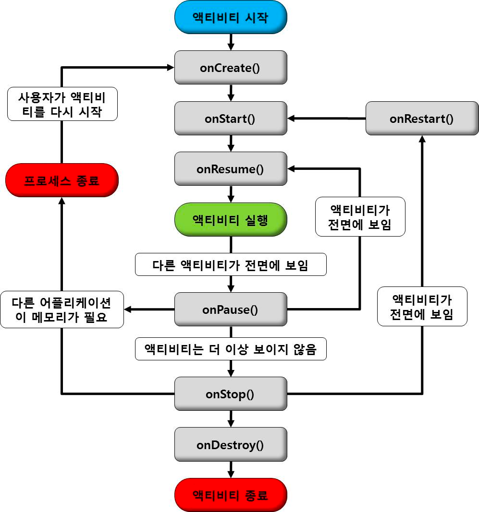

## 액티비티 생명주기 

- onCreate()
    - Activity가 생성될 때 실행
    - 뷰를 구성하고 데이터 바인딩, viewModel 연결 등 초기화 작업
    - setContentView()를 통해 레이아웃을 화면에 띄움
- onStart()
    - 시작됨 상태 → 사용자에게 표시
    - 액티비티를 foreground로 보내 사용자와 상호 작용 준비
- onResume()
    - 상호작용 바로 직전에 호출
    - 터치하거나 뭔가를 입력하는 이벤트를 포착
    - 핵심 기능을 구현
- onPause()
    - 뒤로 가기나 Activity가 실행되어서 원래 액티비티가 background로 갔을 경우 호출
    - 다른 액티비티에 가려 일부만 보여지는 경우 호출
    - 실행 시간이 짧기 때문에 작업이 완료되기 전에 함수가 끝날 수 있음
- onStop()
    - Activity가 사용자에게 더 이상 표시되지 않을 때 호출
    - onPause는 일부만 가려진 반면, onStop은 완전히 가려짐
    - → onResrat , → onDestory 두가지 선택지
- onRestart()
    - 액티비티가 중지됨 상태였다가 다시 시작될 때
    - 이전 상태를 복원하며 onRestart→ onstart() 실행
- onDestroy()
    - 액티비티가 중지됨 후 종료하면 호출, 모든 리소스 해제

### onStop()과 DB 업데이트
- onStop()에서 모든 DB 업데이트를 진행할 수 없다
- 이유는 디바이스의 메모리가 부족해 우선순위가 낮은 프로세스를 종료해야 한다면 onPause에서 종료될 수도 있음
- onStop(), onDestroy()가 호출된다는 보장이 없다.