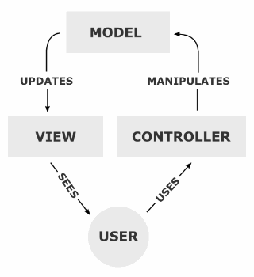
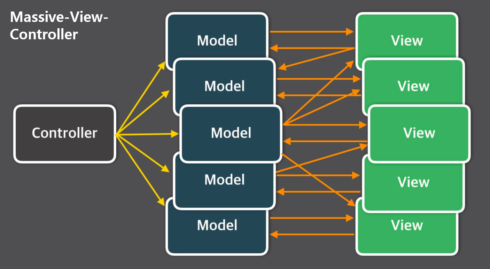

## MVC

- 소프트웨어 디자인 패턴으로 모델, 뷰 , 컨틀로러 존재
- 사용자 인터페이스로부터 비즈니스 로직을 분리하여 애플리케이션의 시각적 요소나 비즈니스 로직이
  서로 영향 없이 고칠 수 있는 앱을 만들 수 있다
- 컨트롤러, 모델, 뷰 
- 모델은 애플리케이션의 정보 즉 데이터를 나타냄
- 뷰는 텍스트, 체크박스 사용자 인터페이스 요소를 나타냄
- 컨트롤러는 데이터와 비즈니스 로직 사이에서 상호 동작을 나타냄 

### Model

- Data와 애플리케이션이 무엇을 할 것인지를 정의하는 부분
- 내부 비즈니스 로직을 처리하기 위한 역할
- 사용자가 편집하기를 원하는 데이터 보유
- view나 controller에 대하여 어떤 정보도 알지 못해야 함
- 변경이 일어나면 처리방법을 구현

### View

- 사용자에게 보여지는 화면
- 사용자와 상호작용하여 컨트롤러부터 받은 모델의 결과값을 사용자에게 화면으로 출력
- 여러개의 view가 존재하며 모델의 데이터를 저장해서는 안됨

### Controller

- Model과 View 사이를 이어주는 인터페이스 역할을 함
- Model이 데이터를 어떻게 처리할지 알려주는 역할 

### 장점

- 기능별로 코드를 분리하여 하나의 파일에 코드가 모이는 것을 방지 -> 가독성과 재사용 증가
- 각 구성요소들을 독립시켜 협업을 할 때 맡은 부분의 개발에만 집중 -> 개발 효율성 증가
- 개발 후에 유지보수 증가 

### 한계 

- 모델과 뷰가 독립적이라 할지라도 컨트롤러를 통해 소통을 이루기에 완전히 분리할 수 없음
- 컨트롤러가 불필요하게 커지는 현상이 발생

