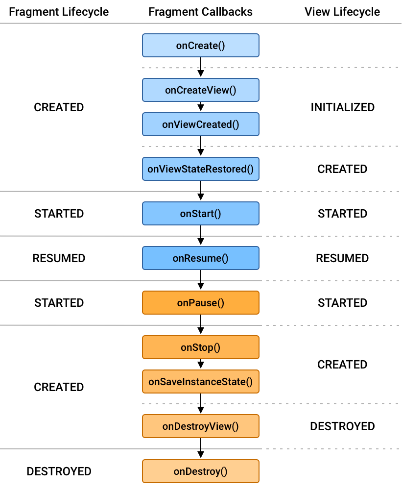

## viewLifeCycleOwner

- onCreateView() 에서 생성되는 view의 LifeCycle
- onCreateView() ~ onDestroyView() 라이프 사이클을 가짐

### Fragment LifeCycle과의 차이

- Fragment LifeCycle은 onAttach ~ onDestroy()의 생명주기
- Fragment ViewLifeCycle은 createView ~ destoryView()의 생명 주기를 가짐
- 프래그먼트 라이프사이클은 프래그먼트 생성부터 제거 과정 진행 
- 프래그먼트 뷰 라이프파이클은 뷰가 생성부터 뷰가 제거 과정 진행

### 결론

- Fragment LifeCycle에서 호출 시 IllegalStateException 에러 발생

### 뷰 라이프 사이클과 프래그면트 라이프 사이클
