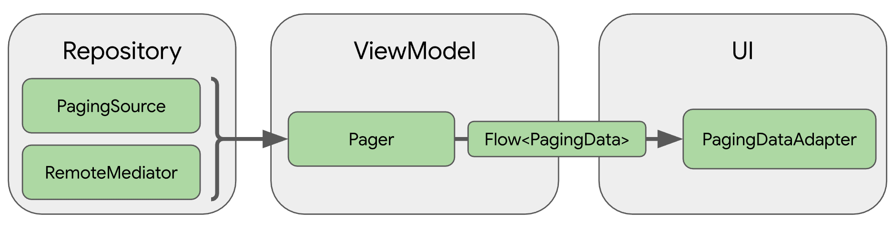

## 페이징 라이브러리 
- 사용자에게 정보를 표시하는 list에 사용함
- 정보를 점진적으로 가져오며, 로컬이나 네트워크를 통해 데이터를 로드하고 화면에 표시한다.
- 효율적인 리소스 관리가 가능하며, 중복된 데이터 요청 제거로 시스템 리소스를 효율적으로 사용 가능하다.
- 사용자가 로드된 데이터를 끝까지 스크롤 했을 때, 어댑터가 자동으로 데이터를 요청한다.
- 코루틴, LiveData, RxJava를 최고 수준으로 지원한다.
- 새로고침과 재시도 같이 에러 처리 방식을 지원한다.

### 핵심 컴포넌트
- #### PagingSource
  - 특정 페이지 쿼리의 데이터 청크를 로드하는 기본 클래스
  - 데이터 레이어의 일부로 일반적으로 DataSource 클래스에서 확인할 수 있음
  - ViewModel에서 사용하기 위해서 Repository에서 사용된다.
  - **네트워크 소스 및 로컬 데이터베이스를 포함한 단일 소스에서 데이터를 로드**할 수 있다.
- #### PagingConfig
  - 페이징 동작을 결정하는 매개변수를 정의하는 클래스로 **페이지의 크기, placeholder 사용 여부가 포함**
- #### Pager
  - PagingData를 생성하는 클래스로 PagingConfig를 따른다, **ViewModel에서 생성**된다.
- #### PagingData
  - 페이지로 나눈 **데이터의 스냅샷을 가지고 있는 컨테이너**
  - 데이터를 새로고침할 때마다 자체 PagingSource로 지원되는 상응 PagingData 생성
  - PagingSource 객체를 쿼리해 결과를 저장한다
- #### PagingDataAdapter
  - RecyclerView에서 PagingData를 출력한다.
  - 내부 페이징데이터 로드 이벤트를 수신하고 페이지가 로드될 때 UI를 효율적으로 업데이트한다.

### 라이브러리 아키텍처!

- #### Repository
  - PagingSource : 데이터 소스와 이 소스에서 데이터를 검색하는 방법을 정의
  - RemoteMediator : 로컬 데이터베이스 캐시가 있는 네트워크 데이터 소스 같은 데이터 소스의 페이징 처리
- #### ViewModel
  - Pager : PagingSource 객체 및 PagingConfig 객체를 바탕으로 반응형 스트림에 출력되는 
    PagingData 인스턴스를 구성하기 위해 공개 API를 제공
  - PagingData로 ViewModel 레이어를 UI에 연결
- #### UI
  - PagingDataAdapter -> 페이징 기법으로 나눈 데이터를 처리
  - AsyncPagingDataDiffer -> 고유한 맞춤 어댑터 빌드도 가능 