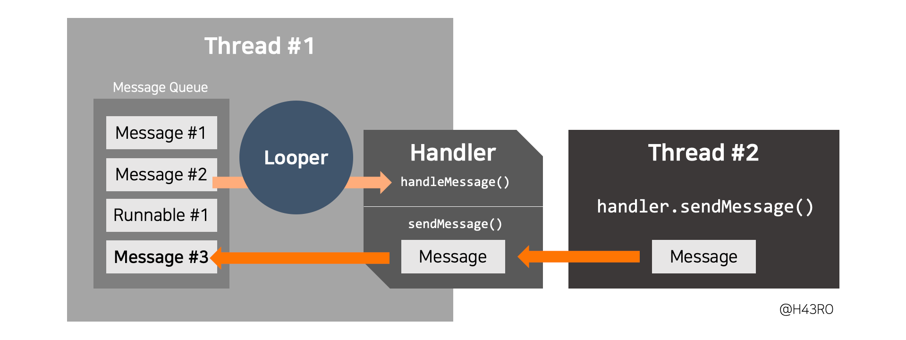

### Lopper 
- MessageQueue에 들어오는 메시지들을 하나씩 꺼내어 적절한 핸드러로 전달하는 역할을 함
- 하나의 스레드에는 하나의 루퍼만 가지고, 루퍼도 하나의 스레드만 관리
- 기본적으로 루퍼는 어떤 핸들러에 메시지를 전달해야 하는에 대한 참조를 가지고 있음 
- 안드로이드는 기본적으로 MainActivity가 실행됨과 동시에 자동으로 메인 쓰레드의 루퍼가 동작

### 메시지
- 하나의 작은 작업 단위
- 작은 작업 단위를 메시지 큐에 적재한 후, 루퍼에서 차례대로 처리 
- **Runnable** 객체, **Message** 객체로 이루어짐
  - Runnable 객체에 담겨져 있으면, Handler에 메시지를 전달하지 않고 run()을 수행 
  - 메시지 객체에 담겨여 있으면 Handler의 HandleMessage() 수행 

### Handler
- 특정 메시지를 Looper의 MessageQueue에 넣는 역할
- 루퍼가 MessageQueue에서 특정 메시지를 꺼내어 전달하면 처리하는 기능 수행

#### 핸들러에서 루퍼로 메시지를 전달하는 경우
- Message 객체를 생성하여 이를 전달
- sendMessage() 메소드를 통해 메시지 큐에 Message 객체를 적재
- post로 시작하는 메소드들로 Runnable 객체를 직접 적재 가능

#### 루퍼로부터 메시지를 전달받는 경우
- Looper가 메시지 큐에서 메시지 하나를 딱 꺼냈을 때 2가지 경우에 대한 대응을 함
  - Runnable 객체 적재 상태 -> 해당 Runnable의 run() 메소드를 호출하여 작업을 실행할 수 있음
  - Message 객체 적재 상태 -> 해당 메시지 내부의 핸들러가 가지고 있는 handleMessage() 메소드 호출로
    Handler가 메시지를 전달받을 수 있음 

### 루퍼와 핸들러 동작 흐름

- 다른 스레드에서 특정 스레드 핸들러의 sendMessage()를 활용해서 메인 스레드 루퍼의 메시지큐에 메시지를 전달
- 해당 스레드의 루퍼는 메시지 큐에서 Loop()를 통해 메시지를 하나씩 핸들러에 전달
- 핸들러에서 handleMessage()를 통해 메시지 처리 
- 핸들러는 루퍼에 의존적이며, 루퍼가 없다면 동작할 수 없음 

### 핸들러와 루퍼 생성
~~~
var handler: Handler? = null
val thread = Thread {  // Runnable 익명 객체 구현
    Looper.prepare()
    handler = Handler()
    Looper.loop()
}
thread.start()
~~~