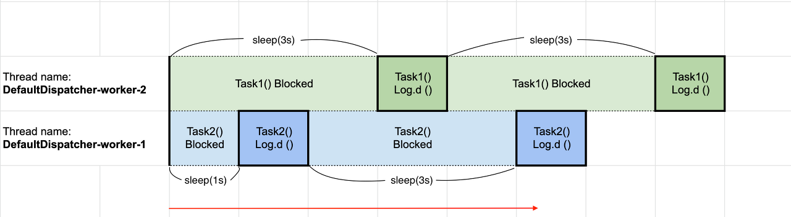
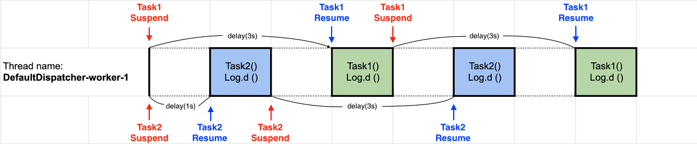

## Suspend
- "중지하다"
- 비동기 실행을 위한 중단 지점의 의미
- 잠시 중단하여 다시 시작(resume)

### suspend Function이 없는 경우
- thread가 block 될 경우, 해당 thread는 다른 작업을 할 수 없는 block 상태가 됨
- block 상태가 끝날 때까지 해당 thread는 중지 상태
- suspend function을 사용할 경우, blocked 된 상태에 놓일 때 그 작업을 suspend,
- 그 기간 동안 thread에서 다른 작업을 수행 

### suspend Function을 사용한 경우 

- coroutine의 suspend 함수는 thread를 block 하지 않음 
- 하나의 thread에서 여러 개의 coroutine을 실행할 수 있음
- suspend는 많은 concurrent 작업을 지원하면서 blocking에 대한 메모리 절약이 가능 
- 따라서 light-weight 스레드