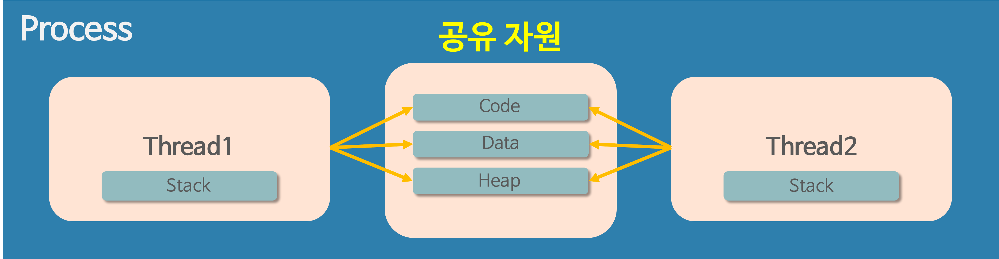

## 멀티 프로세스

- 하나의 응용 프로그램을 여러 개의 프로세스로 구성하여 각 프로세스가 하나의 작업을 처리하도록 하는 것
- 장점 
  - 여러 개의 자식 프로세스 중 하나의 문제가 발생하면 그 프로세스만 죽음 -> 안정성 확보
- 단점
  - Context Switching에서의 오버헤드
  - 캐쉬 메모리 초기화 등 무거운 작업이 진행, 많은 시간 소모 
  - 프로세스 사이에 어렵고 복잡한 통신 기법을 사용해야 한다

### Context Switching?
- CPU에서 여러 프로세스를 돌아가면서 작업을 처리하는 과정

## 멀티 스레드

- 하나의 응용 프로그램을 여러 개의 스레드로 구성하고, 각 스레드로 하여금 하나의 작업을 처리하는 것
- 장점
  - 시스템 자원 소모 감소 ( 프로세스를 생성하는 시스템 콜이 줄어들어 자원을 효율적으로 관리 )
  - 시스템 처리량 증가 (처리 비용 감소, 스레드 간 데이터를 주고 받는 것이 간단해짐 )
  - 간단한 통신 방법 
- 단점
  - 주의 깊은 설계와 까다로운 디버깅
  - 단일 프로세스 시스템의 경우 효과가 적음 
  - 다른 프로세스에서 스레드를 제어할 수 없음
  - 동기화 문제, 자원 공유 문제 발생 
  - 하나의 스레드 문제 시 전체 프로세스가 영향을 받음

### 멀티 프로세스 대신 멀티 스레드를 사용하는 이유

- 프로그램을 여러 개 키는 것보다 하나의 프로그램 안에서 여러 작업을 해결하는 것 
- 주의할 점이 멀티 스레드의 단점, 사용하는 이유가 멀티 스레드의 장점 ! 
