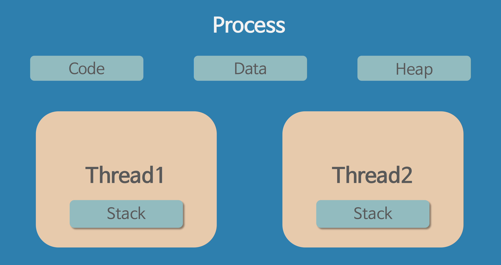

## 스레드

- 프로세스 내에서 실행되는 여러 흐름의 단위
- 프로세스의 특정한 수행 경로로 할당받은 자원을 이용하는 실행의 단위이다.
- 스레드는 프로세스 내에서 각각 Stack만 따로 할당받고 Code, Data, Heap 영역은 공유한다.

- 한 프로세스 내에서 동작하는 여러 실행의 흐름
- 같은 프로스세 내의 여러 스레드들은 같은 힙 공간을 공유
- 각 스레드는 별도의 레지스터와 스택을 가지지만 서로 읽고 쓰기 가능 