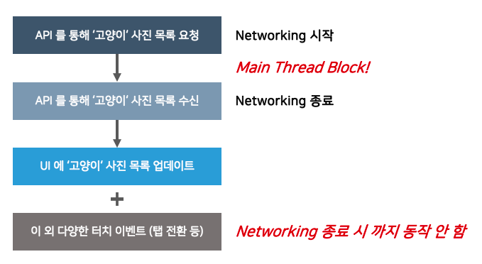
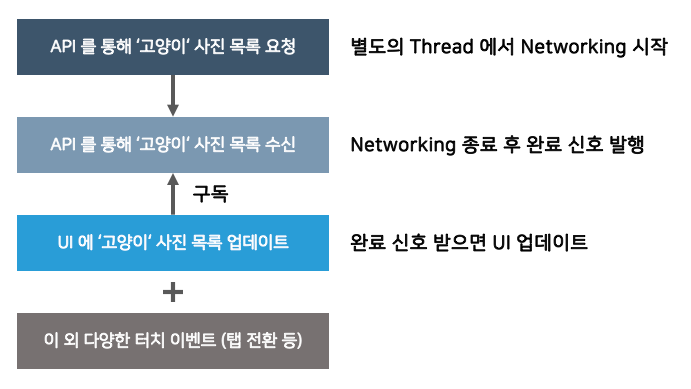

### 반응형 프로그래밍
- 함수형 프로그래밍의 지원이 필요
- 비동기적인 데이터 스트림을 이용한 프로그램이 기법
- 모든 데이터를 스트림으로 봄
  - 스트림 : 시간 순으로 이벤트 나열, 각 시그널 발생 (value, error, complete)
- 기본 베이스는 Observer Pattern을 사용
- 하나의 데이터 스트림을 감시하는 대상이 있다면, 데이터 스트림의 변화가 발생할 때 변화 전파 발생
- 감시 대상이 이를 감지하여 관련 작업 수행
#### 특징
  - 데이터가 변경될 때마다 관련된 로직을 일일히 호출하는 것이 아닌, 데이터 스트림이 존재
  - 이를 구독하는 곳에서 변화에 따라 알아서 처리

#### 명령형과 차이점
  - 명령형은 어떤 동작에 중점을 두고 요청을 받아서, 일회성 결과값 수신
  - 명령형 보다 효율적인 반응형
  - 새로운 데이터가 발생하면, 데이터의 소비자에게 지속적으로 발행
  - 여러개의 스트림을 조합해서 새로운 스트림을 만들어 낼 수 있음 

#### 비동기 처리를 안했을 때 

#### 비동기 처리 

- 새로운 일을 할 때 원래 하던 일, 다른 일을 그대로 이어감
- 모든 작업이 완료하면, API 호출 주체에게 알린다.
- Callback 메소드를 통해 전달해줌