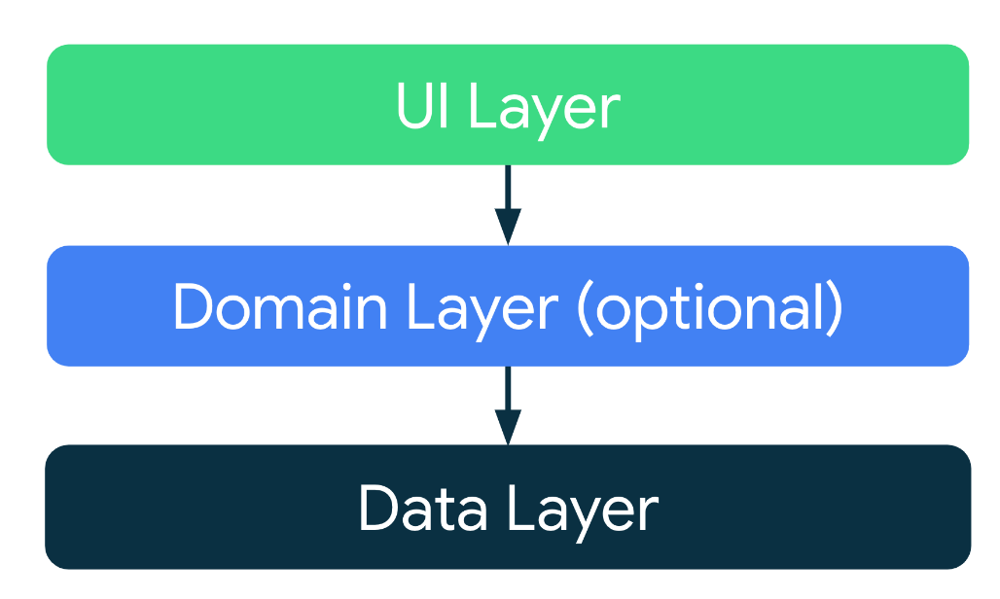
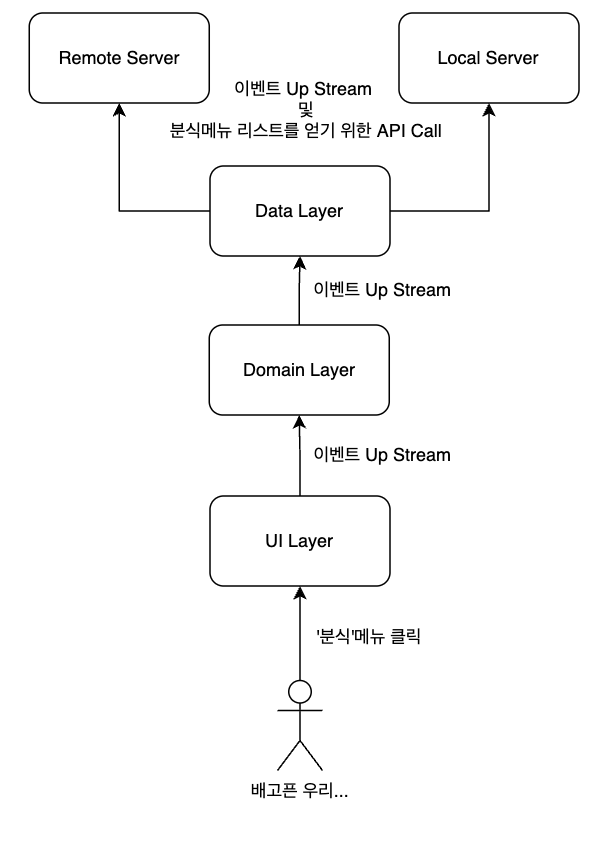
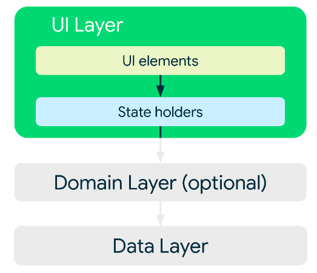

## 안드로이드 클린 아키텍처

### Up Stream과 Down Stream
- Up : 사용자 클릭 등의 이벤트로 ui -> domain -> data
- down: Remote or Local Server로 부터 data -> domain -> ui

### UI Layer

- UI Elements Module
  - Activity/ Fragment or Compose UI
- UI State Holder Module
  - ViewModel
  - UI에 바인딩되는 데이터를 보유하고 있는 모듈 
  - LiveData나 StateFlow를 활용해서 데이터를 바인딩 

### UI 레이어의 ViewModel의 책임

- UPStream 관점 
  - ViewModel이 비즈니스 로직 출발 지점
  - DomainLayer or DataLayer에 디이벤트를 전달하여 비즈니스 로직의 시작을 트리거
- DownStream 관점
  - ViewModel은 DomainLayer or DataLayer로 부터 UI에 바인딩될 구조를 응답 받음
- 최종적으로 UI에 바인딩해준 데이터를 상태 홀더 클래스 (LiveData or StateFlow)를 통해 보유

### Domain Layer

- 선택적 옵션 
- 앱의 서비스가 커질 경우 필요
- 네이밍 컨벤션이 존재
https://velog.io/@squart300kg/%EC%95%88%EB%93%9C%EB%A1%9C%EC%9D%B4%EB%93%9C-Clean-Architecture%EC%97%90-%EB%8C%80%ED%95%98%EC%97%AC
- UseCase 패턴
- 상기 ViewModel 책임 이외의 비즈니스 로직의 책임
- 여러 ViewModel에서 사용되는 중복코드를 정의하는 책임

### Data Layer

- Repository
- DataSource
- UpStream 관점 
  - 앱 내 필요 데이터를 DataSource에 요청하는 책임
- DownStream 관점에서 DataSource로부터 받아온 데이터를 새로운 모델로 가공하여 
  하위 레이어에 전달 (Domain or UI)
- 가공한 데이터를 Repository 모듈에 캐싱하는 책임 
