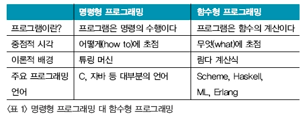

## 함수형 프로그래밍

- 절차지향, 객체지향 프로그래밍 -> 명령형 프로그래밍
- 중점적 시각으로 볼때, 함수형 프로그래밍은 '어떻게'에 초첨을 둔다.

### 함수형 예시 

"정자역에서 네이버 본사로 이동할 경우"
- 명령형의 경우
  - 횡단보도까지 90m, 이후 횡단, 이후 612m 이동....
- 함수형의 경우
  - 성남시 분당구 성남대로 333 -> 성남시 분구 불정로 6
- -> 명령형은 '이렇게'에 초점을, 함수형은 네비게이션을 이용하는 등의 '어떻게'에 초점을 둠
- 명령형은 설명을 주로하고, 함수형은 동작 자체가 "추상화" 되어있음
- return a+b+c 를 함수형으로 전환하면 return sum(a,b,c)

### 함수형의 특징
- 추상화의 개념을 극대화하기 위해서 람다함수, 고차함수를 활용한다
- 함수 안에 함수를 선언하거나 함수를 변수에, 함수의 매개변수로 함수를 넣는 경우도 있다.
- 모든 것을 순수 함수로 나누어 문제를 해결하는 기법
- 작은 문제를 해결하기 위한 함수를 작성하여 가독성을 높이고 유지보수를 용이하게 함 
- 대입문이 없는 프로그래밍