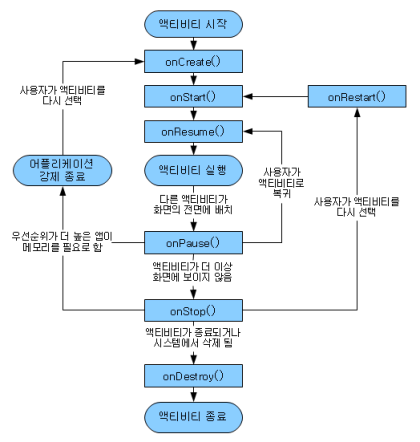
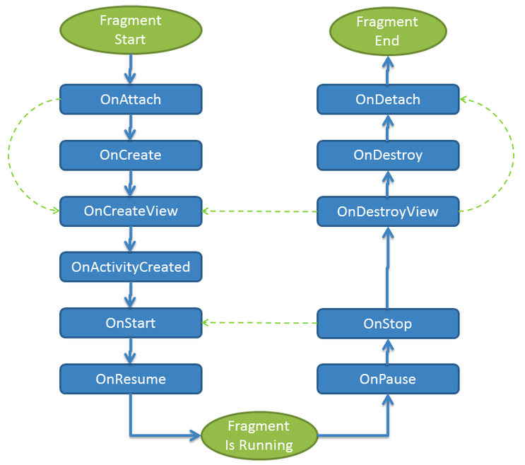

### Android 4대 컴포넌트
1. Activity : UI 화면을 담당, 앱은 반드시 1개 이상의 액티비티를 가져야 함
2. Service : 백그라운드 처리 작업을 위해 사용, 서비스 클래스를 상속 받아 사용
3. Broadcast Receiver : 시스템에서 발생하는 각종 이벤트를 수신하는 역할
4. Content Provider : 다른 애플리케이션 및 로컬 데이터를 제공

### 액티비티 생명주기

### 프래그먼트 생명주기
